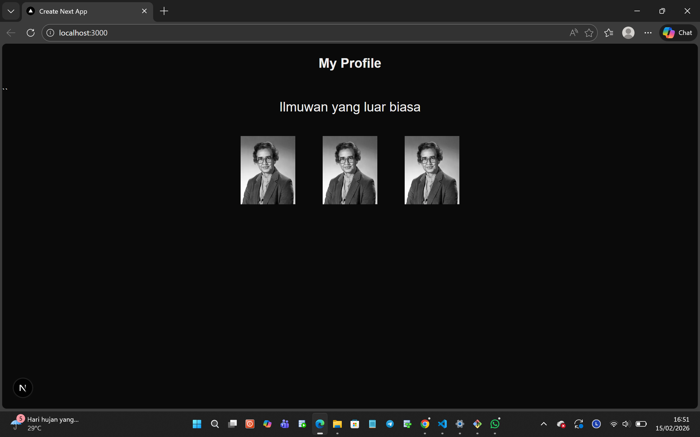
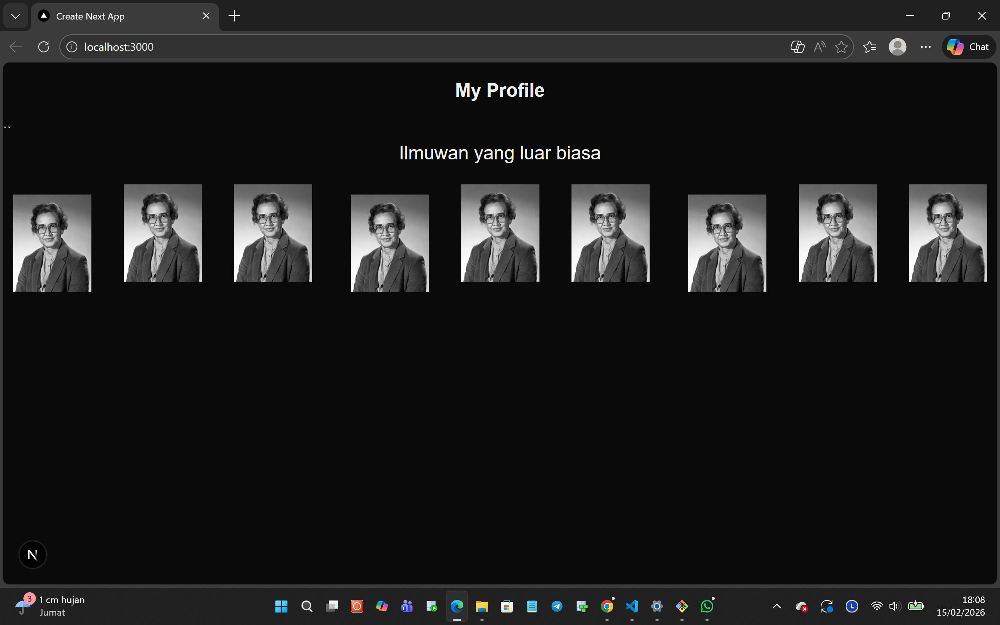
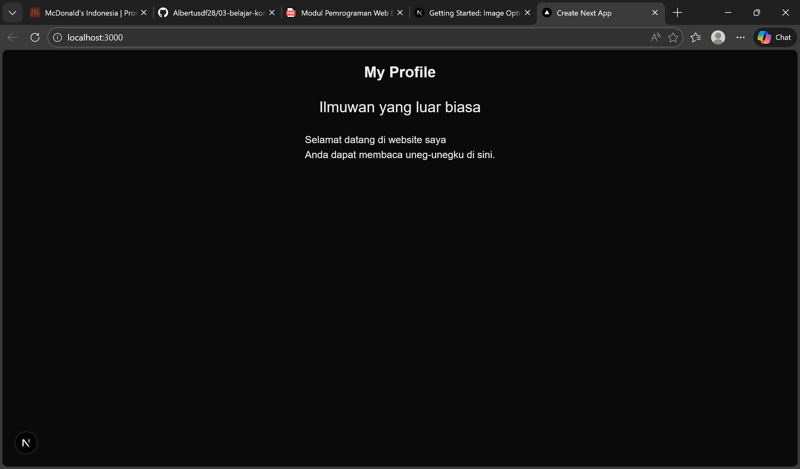
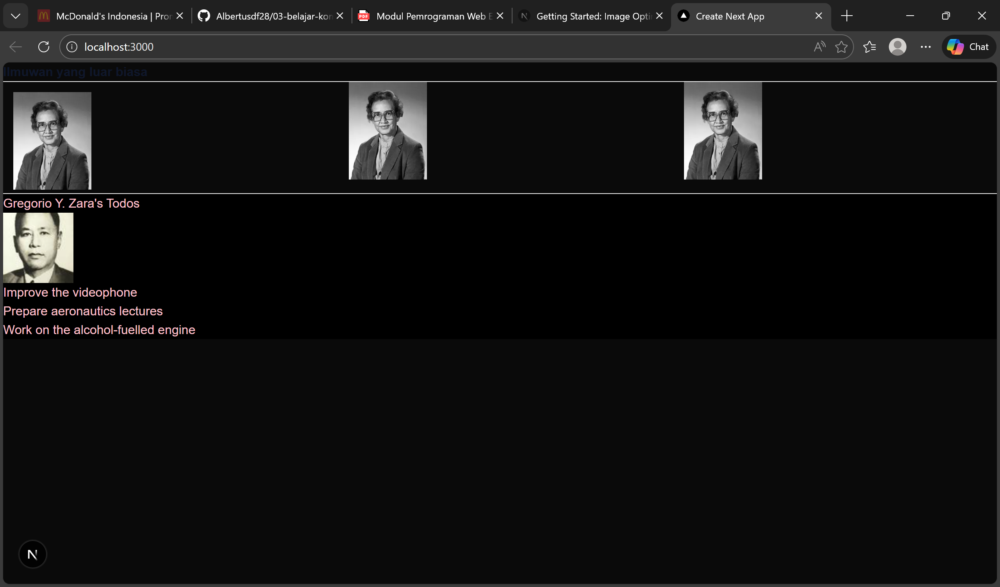

# W03 – Belajar Komponen (Next.js)

## Hasil Tampilan
Berikut adalah hasil implementasi komponen Profile pada halaman utama:

## Apa yang Saya Pelajari
Pada tugas ini saya mempelajari:
    Soal 1:
        - Cara membuat komponen React menggunakan function
        - Cara menggunakan komponen Image dari Next.js
        - Cara melakukan import komponen ke page.tsx
        - Cara menampilkan beberapa komponen dalam satu halaman
        - Pengaturan layout menggunakan flexbox
        
    Soal 2:
        - Cara membuat Named Export Components {Gallery}
        - Cara menggunakan komponen Gallery pada Page.tsx

    Soal 3:
        - JSX hanya boleh me-return satu elemen utama (root)
        - Atribut HTML `class` harus ditulis sebagai `className` (camelCase)
        - Tag HTML harus ditutup dengan benar seperti ` ` harus menggunakan ` `

    Soal 4:
        - JSX tidak dapat menampilkan object secara langsung
        - Data object harus diakses melalui properti tertentu
        - Penggunaan inline style pada JSX        